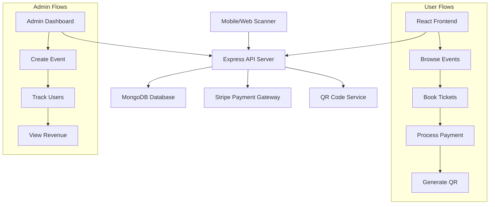

# Event Ticketing System Architecture Plan

## Overview
This plan outlines the architecture and implementation strategy for a comprehensive event management system inspired by BookMyShow, designed for college events. The system automates event management with user registration, ticket booking, payments, QR generation, entry scanning, and admin functionalities including event creation, user tracking, revenue monitoring, sponsor management, and analytics.

## Requirements Analysis

### Core Modules

#### User Registration System
- Secure user authentication with JWT
- User profiles with name, email, interests
- Registration for events with profile data storage

#### Ticket Booking System
- Digital ticket generation with unique QR codes
- Secure payment processing with Razorpay
- QR-based ticket validation at event entry

#### Admin Dashboard
- Full CRUD operations for event management
- User registration tracking and filtering
- Revenue monitoring with real-time updates
- Data export capabilities (Excel, PDF)

#### Sponsor Management System
- Sponsor profile storage (company info, contacts, agreements)
- Payment tracking and commitment monitoring
- Dynamic sponsor banner display on event pages
- Tiered sponsorship levels (gold, silver, etc.)

#### Automation Engine
- Automated email confirmations post-registration
- Scheduled reminder messages (email/SMS) before events
- Bulk announcement system for updates/promotions

#### Analytics Dashboard
- Key metrics: registrations, revenue, conversion rates
- Interactive charts and data visualization
- Filtering and export options

### User Workflow
1. **Browse Events**: Filter events by interests, view details
2. **Book Ticket**: Select event, choose tickets, proceed to payment
3. **Pay**: Secure Razorpay integration
4. **Get QR**: Unique QR code generation and display
5. **Entry Scan**: QR validation and attendance marking

### Admin Workflow
1. **Create Event**: Event creation with sponsor integration
2. **Track Users**: Analytics and user management
3. **View Revenue**: Financial reporting and exports

### Advanced Features
- **AI Recommendation System**: ML-based event suggestions
- **Smart Pricing System**: Dynamic pricing and discounts
- **Marketing Automation**: Promo emails, WhatsApp integration, A/B testing
- **Mobile Scanner**: React Native or web-based entry scanning

## Technology Stack
- **Frontend**: React.js with TypeScript
- **Backend**: Node.js with Express.js and TypeScript
- **Database**: MongoDB with Mongoose ODM
- **Authentication**: JWT (JSON Web Tokens)
- **Payment Processing**: Razorpay API
- **QR Code Generation**: qrcode npm package
- **Email Automation**: Nodemailer
- **SMS Integration**: Twilio
- **Data Visualization**: Chart.js
- **File Export**: xlsx and pdfkit libraries
- **AI/ML**: TensorFlow.js for recommendations
- **Validation**: Joi for input validation
- **Scheduling**: Node-cron for automation
- **Mobile Scanner**: React Native (optional for advanced mobile app)

## System Architecture



## Database Schema

### Users Collection
```javascript
{
  _id: ObjectId,
  name: String,
  email: String,
  password: String, // hashed
  role: String, // 'user' or 'admin'
  createdAt: Date
}
```

### Events Collection
```javascript
{
  _id: ObjectId,
  name: String,
  description: String,
  date: Date,
  venue: String,
  capacity: Number,
  availableTickets: Number,
  price: Number,
  createdBy: ObjectId, // admin user
  status: String, // 'active', 'cancelled', 'completed'
  createdAt: Date
}
```

### Bookings Collection
```javascript
{
  _id: ObjectId,
  userId: ObjectId,
  eventId: ObjectId,
  ticketsCount: Number,
  totalPrice: Number,
  status: String, // 'pending', 'confirmed', 'cancelled'
  qrCode: String, // generated QR data
  createdAt: Date
}
```

### Payments Collection
```javascript
{
  _id: ObjectId,
  bookingId: ObjectId,
  amount: Number,
  currency: String,
  razorpayOrderId: String,
  razorpayPaymentId: String,
  status: String, // 'pending', 'succeeded', 'failed'
  createdAt: Date
}
```

### Sponsors Collection
```javascript
{
  _id: ObjectId,
  companyName: String,
  contactPerson: String,
  email: String,
  phone: String,
  sponsorshipLevel: String, // 'gold', 'silver', 'bronze'
  agreementTerms: String,
  paymentAmount: Number,
  paymentStatus: String, // 'pending', 'paid', 'overdue'
  bannerImage: String, // URL or file path
  website: String,
  createdAt: Date
}
```

### EventSponsors Collection (Junction)
```javascript
{
  _id: ObjectId,
  eventId: ObjectId,
  sponsorId: ObjectId,
  displayOrder: Number
}
```

## API Endpoints

### Public Endpoints
- `GET /api/events` - Get all active events
- `GET /api/events/:id` - Get event details
- `POST /api/auth/login` - User login
- `POST /api/auth/register` - User registration

### Protected User Endpoints
- `POST /api/bookings` - Create booking
- `GET /api/bookings/:id` - Get booking details
- `GET /api/qr/:bookingId` - Get QR code data
- `POST /api/payments/create-intent` - Create payment intent

### Protected Admin Endpoints
- `POST /api/events` - Create new event
- `PUT /api/events/:id` - Update event
- `DELETE /api/events/:id` - Delete event
- `GET /api/bookings/event/:eventId` - Get bookings for event
- `GET /api/revenue` - Get revenue statistics
- `POST /api/sponsors` - Create sponsor
- `GET /api/sponsors` - Get all sponsors
- `PUT /api/sponsors/:id` - Update sponsor
- `DELETE /api/sponsors/:id` - Delete sponsor
- `POST /api/events/:id/sponsors` - Associate sponsors with event
- `POST /api/announcements` - Send bulk announcements
- `GET /api/analytics` - Get analytics data

### Entry Validation Endpoint
- `POST /api/validate-qr` - Validate QR code at entry

### Automation Endpoints
- `POST /api/email/send` - Send automated emails
- `POST /api/sms/send` - Send SMS reminders

## Frontend Components Structure

```
src/
├── components/
│   ├── common/
│   │   ├── Header.tsx
│   │   ├── Footer.tsx
│   │   └── LoadingSpinner.tsx
│   ├── user/
│   │   ├── EventList.tsx
│   │   ├── EventCard.tsx
│   │   ├── BookingForm.tsx
│   │   ├── PaymentForm.tsx
│   │   └── QRCodeDisplay.tsx
│   └── admin/
│       ├── AdminDashboard.tsx
│       ├── EventForm.tsx
│       ├── UserTracker.tsx
│       └── RevenueReport.tsx
├── pages/
│   ├── Home.tsx
│   ├── EventDetails.tsx
│   ├── BookingConfirmation.tsx
│   ├── AdminPanel.tsx
│   └── Login.tsx
├── services/
│   ├── api.ts
│   ├── auth.ts
│   └── stripe.ts
└── utils/
    ├── qrGenerator.ts
    └── validation.ts
```

## Security Considerations
- JWT-based authentication with refresh tokens
- Input validation and sanitization
- HTTPS encryption for all communications
- Stripe webhook verification for payment confirmations
- Rate limiting on API endpoints
- CORS configuration for frontend domain

## Implementation Phases

### Phase 1: Core Infrastructure
1. Set up project structure with frontend/backend separation
2. Initialize Node.js backend with Express, TypeScript, and essential dependencies (Mongoose, Joi, JWT, etc.)
3. Configure MongoDB connection and define all database models (User, Event, Booking, Payment, Sponsor, EventSponsor)
4. Implement JWT-based authentication system with user registration and login
5. Set up basic API server with middleware, error handling, and CORS

### Phase 2: User Registration & Authentication
1. Create user registration and login API endpoints
2. Build React authentication UI (login/register forms)
3. Implement user profile management
4. Add interest-based filtering for events

### Phase 3: Event Management & Browsing
1. Implement CRUD API endpoints for events
2. Build event browsing interface with filtering and search
3. Create event detail views with sponsor banners
4. Add sponsor management APIs and UI

### Phase 4: Ticket Booking & Payment
1. Create booking system with ticket selection and cart
2. Integrate Razorpay payment processing with webhooks
3. Implement QR code generation and display
4. Add payment confirmation and booking status updates

### Phase 5: Admin Dashboard Core
1. Build admin dashboard layout and navigation
2. Implement event creation/management forms
3. Add user tracking and attendee list views
4. Create revenue reporting with basic metrics

### Phase 6: Advanced Features
1. Implement automation engine (Nodemailer for emails, Twilio for SMS, cron jobs)
2. Build analytics dashboard with Chart.js visualizations
3. Add data export functionality (Excel/PDF)
4. Implement AI recommendation system with TensorFlow.js

### Phase 7: Entry & Validation
1. Create QR code validation endpoint
2. Build entry scanning interface (web-based)
3. Implement real-time attendance marking
4. Add mobile scanner support (optional React Native)

### Phase 8: Marketing & Enhancements
1. Implement smart pricing system
2. Add marketing automation with WhatsApp integration
3. Create A/B testing framework for campaigns
4. Optimize performance and add caching

### Phase 9: Testing & Deployment
1. Write comprehensive unit and integration tests (Jest, React Testing Library)
2. Set up CI/CD pipeline
3. Configure production environment with HTTPS and security
4. Deploy to hosting platform and monitor performance

## Backend Implementation Details

### Project Structure
```
backend/
├── src/
│   ├── controllers/
│   │   ├── authController.ts
│   │   ├── eventController.ts
│   │   ├── ticketController.ts
│   │   ├── paymentController.ts
│   │   └── adminController.ts
│   ├── routes/
│   │   ├── authRoutes.ts
│   │   ├── eventRoutes.ts
│   │   ├── ticketRoutes.ts
│   │   ├── paymentRoutes.ts
│   │   ├── adminRoutes.ts
│   │   └── index.ts
│   ├── models/
│   │   ├── User.ts
│   │   ├── Event.ts
│   │   ├── Ticket.ts
│   │   └── Payment.ts
│   ├── middleware/
│   │   ├── authMiddleware.ts
│   │   └── errorHandler.ts
│   ├── utils/
│   │   ├── jwt.ts
│   │   └── logger.ts
│   ├── config/
│   │   └── database.ts
│   ├── app.ts
│   └── server.ts
├── scripts/
│   └── seed.ts
├── .env
├── package.json
├── tsconfig.json
└── README.md
```

### Dependencies (package.json)
```json
{
  "name": "event-ticketing-backend",
  "version": "1.0.0",
  "scripts": {
    "start": "node dist/server.js",
    "dev": "ts-node-dev src/server.ts",
    "build": "tsc",
    "test": "jest"
  },
  "dependencies": {
    "express": "^4.18.2",
    "mongoose": "^7.5.3",
    "jsonwebtoken": "^9.0.2",
    "bcryptjs": "^2.4.3",
    "dotenv": "^16.3.1",
    "cors": "^2.8.5",
    "winston": "^3.10.0",
    "joi": "^17.9.2",
    "razorpay": "^2.9.2",
    "qrcode": "^1.5.3",
    "nodemailer": "^6.9.4",
    "twilio": "^4.19.0",
    "node-cron": "^3.0.3",
    "xlsx": "^0.18.5",
    "pdfkit": "^0.13.0"
  },
  "devDependencies": {
    "@types/express": "^4.17.17",
    "@types/node": "^20.5.7",
    "@types/jsonwebtoken": "^9.0.2",
    "@types/bcryptjs": "^2.4.4",
    "@types/cors": "^2.8.13",
    "@types/node-cron": "^3.0.8",
    "@types/nodemailer": "^6.4.8",
    "ts-node-dev": "^2.0.0",
    "typescript": "^5.1.6",
    "jest": "^29.6.2"
  }
}
```

### TypeScript Configuration (tsconfig.json)
```json
{
  "compilerOptions": {
    "target": "ES2020",
    "module": "commonjs",
    "lib": ["ES2020"],
    "outDir": "./dist",
    "rootDir": "./src",
    "strict": true,
    "esModuleInterop": true,
    "skipLibCheck": true,
    "forceConsistentCasingInFileNames": true,
    "resolveJsonModule": true
  },
  "include": ["src/**/*"],
  "exclude": ["node_modules", "dist"]
}
```

### Environment Variables (.env)
```
PORT=5000
MONGO_URI=mongodb://localhost:27017/event-ticketing
JWT_SECRET=your-jwt-secret-key
RAZORPAY_KEY_ID=your-razorpay-key-id
RAZORPAY_KEY_SECRET=your-razorpay-key-secret
EMAIL_HOST=smtp.gmail.com
EMAIL_PORT=587
EMAIL_USER=your-email@gmail.com
EMAIL_PASS=your-email-password
TWILIO_ACCOUNT_SID=your-twilio-sid
TWILIO_AUTH_TOKEN=your-twilio-token
TWILIO_PHONE_NUMBER=your-twilio-number
```

## Risk Assessment
- **Payment Security**: Use Razorpay's PCI-compliant infrastructure
- **QR Code Integrity**: Implement cryptographic signing for QR validation
- **Scalability**: Design for horizontal scaling with MongoDB sharding
- **Data Privacy**: Comply with GDPR/CCPA regulations for user data

This plan provides a comprehensive blueprint for building a robust event ticketing system. The modular architecture allows for iterative development and easy maintenance.